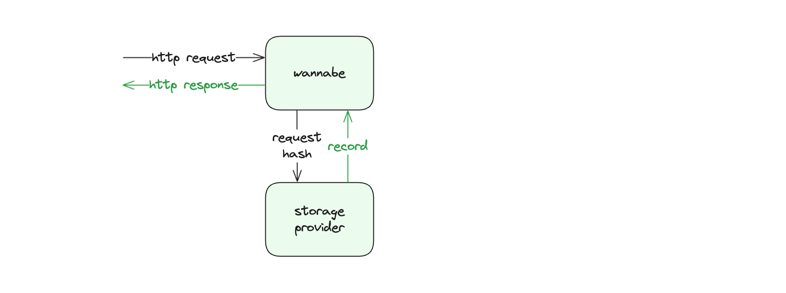
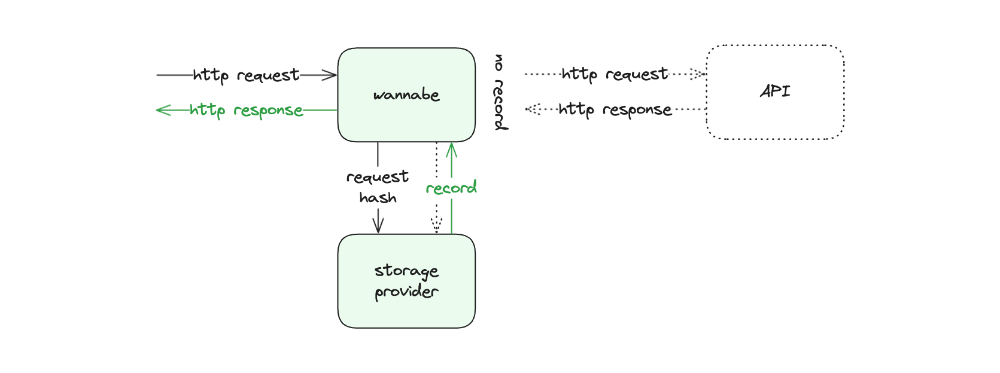
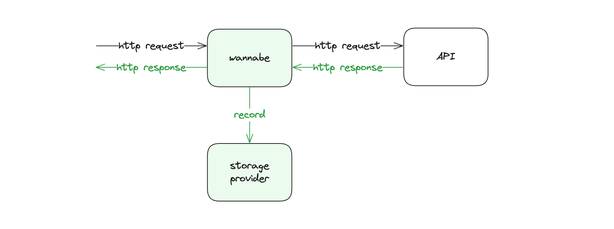
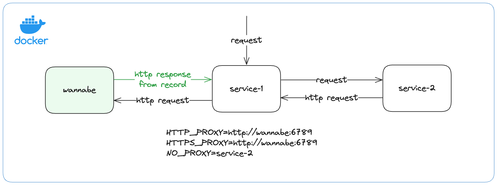

# Wannabe

A versatile Go tool for effortlessly generating mock HTTP APIs for all your needs.

Official docker images are available at [Docker Hub](https://hub.docker.com/r/trco/.wannabe).

## Getting started

For a successful startup, Wannabe requires the configuration and SSL certificate files.

For information on configuring see the [Configuration](#configuration) section. You must generate and use the self-signed SSL certificate for Wannabe to securely proxy HTTPS requests to other servers. It's crucial to ensure that the client's operating system, whether on a local machine or within a containerized environment, trusts the SSL certificate for secure communication with Wannabe. For guidance on adding the SSL certificate to your operating system and configuring trust settings, please refer to the relevant documentation.

### Generate self-signed SSL certificate

```
// generate 2048-bit private key
openssl genrsa -out wannabe.key 2048
```

```
// generate self-signed SSL certificate valid for 10 years
openssl req -new -x509 -key wannabe.key -out wannabe.crt -days 3650
```

### Running as a standalone server

Like any Go program, Wannabe can be launched by simply cloning the repository, adding a `config.json`, `wannabe.crt` and `wannabe.key` to the root of the cloned repository, compiling the source code into an executable binary file using the `go build` command, and then running the program with the `go run` command.

### Running in Docker

Wannabe provides official [Docker images](https://hub.docker.com/r/trco/.wannabe) for running the application within a container.

To ensure a successful launch of the application, the configuration `.json` file and SSL certificate `.crt` and `.key` files should be mounted from the host operating system to the `/usr/src/app` directory of the Wannabe container. The environment variables `CONFIG_PATH`, `CERT_PATH`, and `CERT_KEY_PATH` should be set to the paths where the relevant files are mounted. Inside the container, the Wannabe server operates on port 6789, and the API is accessible through port 6790.

```
// pull the latest Wannabe image from Docker Hub
docker pull trco/wannabe
```

```
// run Wannabe container using config.json and SSL certificate siles wannabe.crt and wannabe.key
docker run -d \
-p 6789:6789 \
-p 6790:6790 \
-v $(pwd)/config.json:/usr/src/app/config.json \
-v $(pwd)/wannabe.crt:/usr/src/app/wannabe.crt \
-v $(pwd)/wannabe.key:/usr/src/app/wannabe.key \
-e CONFIG_PATH=/usr/src/app/config.json \
-e CERT_PATH=/usr/src/app/wannabe.crt \
-e CERT_KEY_PATH=/usr/src/app/wannabe.key \
--name wannabe \
trco/wannabe
```

To proxy requests from containers through Wannabe, the HTTP_PROXY and HTTPS_PROXY environment variables of the container should be set to the Wannabe address. In a container network where a single container communicates through the HTTP layer with multiple other containers, the NO_PROXY environment variable should be set to the addresses of containers that should be excluded from proxying requests through Wannabe. See [Example](#example) for a detailed setup.

## How does it work?

### Server mode

In `server` mode, Wannabe functions as a standalone server. Upon receiving a request, it generates a cURL command from it based on your [Request matching](#request-matching) configuration and generates a hash from the prepared cURL command. Wannabe then looks up the matching [Record](#records) in the [Storage provider](#storage-provider) using the hash as a record key and responds with the stored response if it finds a match, or with an error if a matching record is not found.



### Mixed mode

In `mixed` mode, Wannabe functions as both a standalone server and a proxy server. Upon receiving a request, it generates a cURL command from it based on your [Request matching](#request-matching) configuration and generates a hash from the prepared cURL command. If it finds a matching [Record](#records) for the received request using the hash as a record key, Wannabe responds with the recorded response. If no matching records are found in the storage, Wannabe proxies the received request to the host defined in the request and, upon receiving the response, stores a record in the configured [Storage provider](#storage-provider) using the previously generated hash as the key.



### Proxy mode

In `proxy` mode, Wannabe operates as a proxy server. It derives a cURL command from the received request based on your [Request matching](#request-matching) configuration and hashes it to create a unique identifier. Wannabe then proxies the received request to the host defined in the request and, upon receiving the response, stores a [Record](#records) in the configured [Storage provider](#storage-provider) using the previously generated hash as the key. Each record includes the original request and its corresponding response from the upstream server.



## Usage examples

Wannabe seamlessly mimics any desired HTTP API, whether external or internal, existing or still in development, and without business logic. It can effectively become the HTTP API you need for faster and better development and testing processes.

### Mocking external HTTP APIs

Wannabe allows developers to record and simulate the behavior of external services, eliminating the need for reliance on those services during development and testing. This spans from initial development to regression testing.

#### Example

The scheme below shows a containerized testing environment for integration tests of `service-1`. In a production environment, `service-1` would make an HTTP request to an external HTTP API. However, in this testing environment, all outbound requests from `service-1` are proxied to `wannabe` based on the proxy configuration of `service-1` (HTTP_PROXY, HTTPS_PROXY, NO_PROXY environment variables). Once the HTTP request is executed against `wannabe`, it finds the response for the matching request in the relevant record and responds to `service-1` with it.

This way, integration tests of `service-1` are completely independent of external services and can be run without any limitations imposed by external HTTP APIs. This includes issues such as downtime, rate limiting, varying response times, temporary errors, or access fees.



### Mocking internal HTTP APIs

Developers can use Wannabe to prepare mocks of non-existing HTTP APIs and share them with other teams before implementing any business logic. These mocks facilitate development and testing processes, spanning from initial development to regression testing.

### Reusability

Wannabe [Records](#records), along with their underlying [Configuration](#configuration) files, can be shared among developers, teams, and businesses. This accelerates development processes by providing robust and well-tested mocks.

Wannabe can certainly support numerous other use cases. If you discover an innovative use case for Wannabe, please share it with us.

## Configuration

Wannabe requires a configuration file in `.json` format. Any changes made to the configuration file will only take effect after restarting the standalone Wannabe server or the one running in the container.

The configuration file consists of three root fields: [mode](#mode), [storageProvider](#storage-provider), and [wannabes](#wannabes). Refer to the following subsections for details on all the options that can be configured using these root fields.

### Defaults

When the `"mode"` or `"storageProvider"` fields are not defined in the configuration, they default to the values below. The `"wannabes"` field is optional.

```jsonc
{
    "mode": "mixed",
    "storageProvider": {
        "type": "filesystem",
        "filesystemConfig": {
            "folder": "records",
            "regenerateFolder": "records/regenerated",
            "format": "json"
        }
    }
}
```

### Mode

```jsonc
{
    // options: "proxy", "server", "mixed"; defaults to "mixed"
    "mode": string
}
```

The `"mode"` field defines how a Wannabe container operates. Refer to the [How does it work?](#how-does-it-work) section for details.

### Storage provider

```jsonc
{
    "storageProvider": {
        // options: “filesystem”; defaults to “filesystem”
        "type": string,
        // see FilesystemConfig section below
        "filesystemConfig": filesystemConfig
    }
}
```

The `"storageProvider"` field configures the storage for saving the records. Based on the specified `"type"` relevant configuration should be defined. For `"type": "filesystem"` the `"filesystemConfig"` is required.

#### Type

The `"type"` field defines the type of storage provider Wannabe should use.

#### FilesystemConfig

```jsonc
{
    "filesystemConfig": {
        // path to the folder, relative to the configuration file
        "folder": string,
        // path to the folder, relative to the configuration file
        "regenerateFolder": string, 
        // options: "json"; json is currently the only supported format
        "format": string 
    }
}
```

The `"filesystemConfig"` field defines the configuration of the file system storage provider.

##### Folder

The `"folder"` field defines the folder for storing the records.

##### RegenerateFolder

The `"regenerateFolder"` field defines a folder for storing the regenerated records.

##### Format

The `"format"` field defines the format in which the records are stored.

### Wannabes

```jsonc
{
    "wannabes": {
        "example.com": {
            // see Request matching section
            "requestMatching": {...},
            // see Records section
            "records": {...}
        },
        "api.github.com": {
            "requestMatching": {...},
            "records": {...}
        },
        ...
}
```

Wannabes are a map of configurations for [Request matching](#request-matching) and [Records](#records) for the hosts that Wannabe mocks, where the host name should be used as a key in the map.

#### Request matching

The `"requestMatching"` field configures the generation of cURL commands and the underlying unique hash identifier for each request received by Wannabe. It allows you to include or exclude specific parts of the requests, whether static or dynamic, from the generation of cURL commands corresponding to those requests, or replace specific request parts with placeholders. This approach enables **the generation of identical cURL commands and underlying hashes for multiple unique requests, thereby enabling Wannabe to store a single record with one response for all those multiple unique requests** in `proxy` mode, and to respond with an identical response for all those requests when in `server` or `mixed` mode.

For example, you can record responses for all possible requests to the Google Analytics Data API for a single `propertyId`, but since you excluded the dynamic `propertyId` from request matching by replacing it with a static placeholder, different `propertyIds` in the request will result in identical cURL commands and underlying hashes, and Wannabe will respond with the responses recorded for a single `propertyId`.

For a better understanding of how this works, refer to the [Usage of index wildcards](#usage-of-index-wildcards), [Usage of key wildcards](#usage-of-key-wildcards) and [Usage of regexes](#usage-of-regexes) sections and the explanations provided therein.

**Important note:** When configuring request matching to include a specific header in the generation of the cURL command and the underlying unique hash identifier for requests, you cannot exclude the same header from being stored in the request field of the records. This ensures that you can always [regenerate](#regenerate-records) existing records with a new request matching configuration, including this specific header. If headers to be included in request matching are not set, all of them are included in matching, and none of them can be excluded from being stored in the request field of records.

```jsonc
{
    "requestMatching": {
        "host": {
            "wildcards": [
                {
                    // required
                    "index": integer,
                    // optional; defaults to "wannabe"
                    "placeholder": string
                }
            ],
            "regexes": [
                {
                    // required
                    "pattern": string,
                    // optional; defaults to "wannabe"
                    "placeholder": string
                }
            ]
        },
        "path": {
            "wildcards": [
                {
                    // required
                    "index": integer,
                    // optional; defaults to "wannabe"
                    "placeholder": string
                }
            ],
            "regexes": [
                {
                    // required
                    "pattern": string,
                    // optional; defaults to "wannabe"
                    "placeholder": string
                }
            ]
        },
        "query": {
            "wildcards": [
                {
                    // required
                    "key": string,
                    // optional; defaults to "wannabe"
                    "placeholder": string
                }
            ],
            "regexes": [
                {
                    // required
                    "pattern": string,
                    // optional; defaults to "wannabe"
                    "placeholder": string
            ]
        },
        "body": {
            "regexes": [
                {
                    // required
                    "pattern": string,
                    // optional; defaults to "wannabe"
                    "placeholder": string
                }
            ]
        },
        "headers": {
             // if not set all headers are included
            "include": string[],
            "wildcards": [
                {
                    // required
                    "key": string,
                    // optional; defaults to "wannabe"
                    "placeholder": string
                }
            ]
        }
    }
}
```

##### Usage of index wildcards

```jsonc
{
    "host": {
        "wildcards": [
            {
                "index": 0,
                "placeholder": "placeholder"
            }
        ]
    }
}
```

When generating cURL commands to be hashed as unique identifiers of requests, the host `https://analyticsdata.googleapis.com` and the given wildcard will result in the `https://placeholder.googleapis.com` host being included in the cURL command.

**Behind the scenes, how it operates:** After trimming the protocol prefix, the host is split using "." as a separator, and the value at the defined index is replaced with a defined placeholder, or `wannabe` placeholder by default.

Requests that differ only in the value at the first index of the host will result in the same cURL command and hash. Therefore, they will be stored as a single record with the underlying response in storage.

##### Usage of key wildcards

```jsonc
{
    "query": {
        "wildcards": [
            {
                "key": "userId",
                "placeholder": "placeholder"
            }
        ]
    }
}
```

When generating cURL commands to be hashed as unique identifiers of requests, the query `?status=completed&userId=123456` and the given wildcard will result in the `?status=completed&userId=placeholder` query being included in the cURL command.

**Behind the scenes, how it operates:** After splitting the query string into an object of key-value pairs, the value of the key defined in the wildcard is replaced with a defined placeholder, or `wannabe` placeholder by default.

Requests that differ only in the value of the defined key in the query will result in the same cURL command and hash. Therefore, they will be stored as a single record with the underlying response in storage.

##### Usage of regexes

```jsonc
{
    "path": {
        "regexes": [
            {
                "pattern": "(\\d+):runReport",
                "placeholder": "{propertyId}:runReport"
            }
        ]
    }
}
```

When generating cURL commands to be hashed as unique identifiers of requests, the path `/v1beta/properties/123456789:runReport` and the given regex will result in the `/v1beta/properties/placeholder:runReport` path being included in the cURL command.

**Behind the scenes, how it operates:** The regex pattern is replaced with the defined placeholder, or the `wannabe` placeholder by default.

Requests that differ only in the regex-defined pattern of the path will result in the same cURL command and hash. Therefore, they will be stored as a single record with the underlying response in storage.

#### Records

```jsonc
{
    "records": {
        "headers": {
            "exclude": "string[]"
        }
    }
}
```

The `"records"` field allows configuring headers to be excluded from the request field of the stored records. This allows exclusion of headers that might pose security risks, such as `Authorization` headers containing access tokens, API keys, or other credentials.

**Important note:** When configuring request matching to include a specific header in the generation of the cURL command and the underlying unique hash identifier for requests, you cannot exclude the same header from being stored in the request field of the records. This ensures that you can always [regenerate](#regenerate-records) existing records with a new request matching configuration, including this specific header. If headers to be included in request matching are not set, all of them are included in matching, and none of them can be excluded from being stored in the request field of records.

## Record entity

After Wannabe retrieves a response for a specific request, it stores it in a record within the [Storage provider](#storage-provider). The hash generated from the request's cURL command is used as the key for the stored record, and the record is added to the folder named after the host the request was made to.

For example, if the storage provider is the file system, and the default `"records"` folder is set for storing records, and the hash generated from the request's cURL command is `d050d9e39f…190b4037a`, and the request was made to `api.github.com`, the record would be stored at the path `records/api.github.com/d050d9e39f…190b4037a.json`.

### Example of the Record

```jsonc
{
    "request": {
        "hash": "f9150cd75f617b8f6a751cab3fc2b2f19b47e2b67cb496c91e5a54a0cf923ff0",
        "curl": "curl -X 'GET' 'http://test.com/api/v1/testId?fields=thumbnail_url'",
        "httpMethod": "GET",
        "host": "test.com",
        "path": "/api/v1/testId",
        "query": {
            "fields": [
                "thumbnail_url"
            ]
        },
        "headers": {
            "Accept": [
                "application/json, text/plain, */*"
            ],
            "Accept-Encoding": [
                "gzip"
            ]
        },
        "body": null
    },
    "response": {
        "statusCode": 200,
        "headers": {
            "Content-Encoding": [
                "gzip"
            ],
            "Content-Type": [
                "application/json"
            ],
            "Date": [
                "Tue, 25 Jun 2024 15:56:20 GMT"
            ]
        },
        "body": {
            "id": "23855754493170305",
            "thumbnail_url": "https://test.com?test.jpg"
        }
    },
    "metadata": {
        "generatedAt": {
            "unix": 1719330980,
            "utc": "2024-06-25T15:56:20.086184Z"
        },
        "regeneratedAt": {
            "unix": 0,
            "utc": "0001-01-01T00:00:00Z"
        }
    }
}
```

## Regenerate records

Wannabe supports the regeneration of existing records with new [Request matching](#request-matching) configurations. To prepare for the regeneration of existing records, follow these steps:

1. Prepare a new [Configuration](#configuration) file with updated [Request matching](#request-matching) configurations for [wannabes](#wannabes) you would like to regenerate records for and set custom [regenerateFolder](#regeneratefolder) when the file system is configured as the [Storage provider](#storage-provider).
2. Restart the running Wannabe instance to load the new configuration file.
3. Execute the regeneration by calling the `GET /wannabe/api/regenerate` endpoint. Refer to the [API Reference](#api-reference) for details.
4. To use the newly regenerated records, copy them to the relevant location in the configured storage provider, ensuring they are not mixed with previous records associated with different configuration files.

**Important notes:**
- Use the regenerate records functionality with caution and always follow the described steps.
- Know which records correspond to which configuration file and ensure that configuration files are always used with relevant records. Regenerated records should not be used with unrelated configuration files.
- Mixing regenerated records with the records used for regeneration in the configured storage provider can result in an inability to differentiate between records.
- The `"regenerateFolder"` path in file system storage provider should not be the same as the `"folder"` path. If it is, the folder will contain a mix of regenerated records and initial records used for regeneration, which could be impossible to separate, especially in cases with a large number of records.

## API reference

```GET /wannabe/api/records/{hash}?host={host}```

Retrieves either all the records, all the records for a specified host, or a single record for a specified host.

**Parameters**

`{host}` (string, optional) - Host for which the records are stored. If the `{hash}` parameter is provided, `{host}` is required.

`{hash}` (string, optional) - The unique identifier of the record. If the `{hash}` parameter is provided, `{host}` is required.

**Response body**

```jsonc
[
    {
        "request": {
            "hash": string,
            "curl": string,
            "httpMethod": string,
            "host": string,
            "path": string,
            "query": {
                "key": string
            },
            "headers": {
                "key": string[]
            },
            "body": object
        },
        "response": {
            "statusCode": integer,
            "headers": {
                "key": string[]
            },
            "body": object / string
        },
        "metadata": {
            "generatedAt": {
                "unix": integer,
                "utc": string
            },
            "regeneratedAt": {
                "unix": integer,
                "utc": string
            },
        }
    }
]
```

```POST /wannabe/api/records```

Stores received records in the configured storage provider.

**Request body**

```jsonc
[
    {
        "request": {
            "scheme": string, // required; "http", "https"
            "httpMethod": string, // required; "GET", "POST", "PUT", "DELETE", "PATCH", "HEAD", "CONNECT", "OPTIONS", "TRACE"
            "host": string, // required
            "path": string,
            "query": {
                "key": string
            },
            "headers": {
                "key": string[]
            },
            "body": object // required if httpMethod equals "POST, "PUT" or "PATCH"
        },
        "response": {
            "statusCode": integer, // required
            "headers": {
                "key": string[]
            },
            "body": object // required
        },
    }
]
```

**Response body**

```jsonc
{
    "insertedRecordsCount": integer,
    "notInsertedRecordsCount": integer,
    "recordProcessingDetails": [
        {
            "hash": string,
            "message": string
        }
    ]
}
```

The `"recordProcessingDetails"` array in the response body contains the `"hash"` and `"message"` for each record posted in the request body in the same indexed order. This means that the record processing details for the first record posted in the request body are at index zero in the `"recordProcessingDetails"` array. In the case of a successfully stored record, the `"message"` equals `"success"`, while in the case of inability to store the record, the message describes the error for why storing failed.

```DELETE /wannabe/api/records/{hash}```

Deletes all the records for a specified host or a single record for a specified host.

**Parameters**

`{host}` (string, required) - Host for which the records are stored.

`{hash}` (string, optional) - The unique identifier of the record. If the `{hash}` parameter is provided, `{host}` is required.

**Response body**

```jsonc
{
    "message": string,
    "hashes": string[]
}
```

```GET /wannabe/api/regenerate?host={host}```

Regenerates records for a specific host using the provided [wannabe](#wannabes) configuration. See the [Regenerate records](#regenerate-records) section for details.

**Parameters**

`{host}` (string, required) - Host for which the records should be regenerated.

**Response body**

```jsonc
{
    "message": string,
    "regeneratedHashes": string[],
    "failedHashes": string[]
}
```

## Frequently Asked Questions

**Why are requests not being proxied through Wannabe even though the HTTP_PROXY and HTTPS_PROXY environment variables have been set to the Wannabe address in the container making outbound HTTP requests?**

The package or logic used for making HTTP requests must support proxying. Otherwise, setting HTTP_PROXY and HTTPS_PROXY environment variables in containers won't result in HTTP requests being properly routed through the proxy. For example, Node.js's [node-fetch](https://github.com/node-fetch/node-fetch) does not support proxying until Node.js version 20, and another package for making HTTP requests, [got](https://github.com/sindresorhus/got), also lacks proxy support, while [axios](https://github.com/axios/axios) does support proxying.

**Why does the request with an HTTPS scheme time out for the record added through the Wannabe API?**

To use records created through the Wannabe API with an HTTPS scheme in the request, the host must be reachable at https://{host}. This allows Wannabe to establish a secure HTTP proxy tunnel to the host.

**Which request and response body content types are currently supported?**

Wannabe currently supports the following content types: *application/json*, *application/xml*, *text/xml*, *text/plain*, and *text/html*.

**Which request and response body content encodings are currently supported?**

Wannabe currently supports the following content encodings: *gzip*.

## Contributing

Thank you for considering contributing to Wannabe! Contributions from the community are more than welcome to help improve the project and make it even better.

### How to Contribute

To contribute to Wannabe, follow these steps:

1. Fork the repository.
2. Create a branch.
3. Develop.
4. Commit changes.
5. Submit a pull request.

Your pull request will be reviewed, and you may be asked to make further changes or address feedback before your contribution is accepted. Adding and updating existing tests is mandatory for pull requests to enter the review process.

### Where to start

If you're eager to contribute to Wannabe but aren't sure where to begin, we've got you covered! You can dive right in by exploring our open issues or checking out our existing "next step" ideas. Simply head over to the Issues tab to get started!

## Author
Uroš Trstenjak (Trčo), [github.com/trco](https://github.com/trco), [Connect on LinkedIn](https://www.linkedin.com/in/uros-trstenjak/).